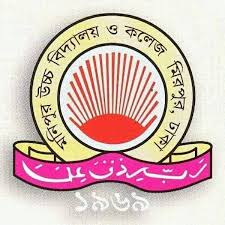
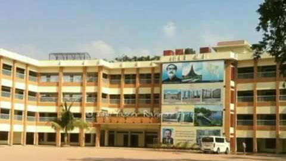
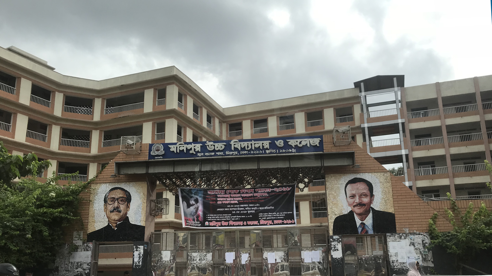
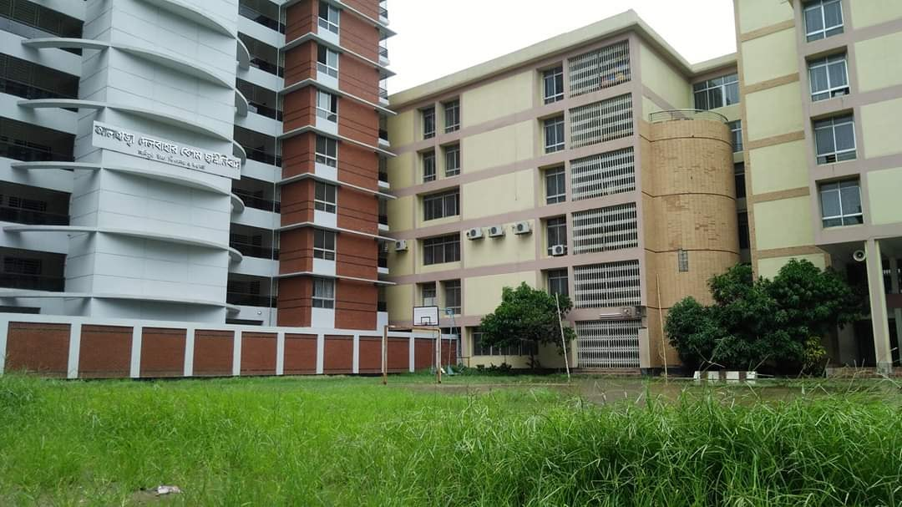
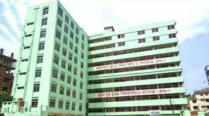
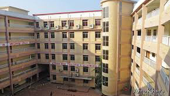

*   [হোম](#home)
*   [মূল বালিকা](#mulbalika)
*   [মূল বালক](#mulbalok)
*   [ব্রাঞ্চ-১](#branch-1)
*   [ব্রাঞ্চ-২](#branch-2)
*   [ব্রাঞ্চ-৩](#branch-3)

# মনিপুর উচ্চ বিদ্যালয় ও কলেজ

## ভূমিকা :

মনিপুর উচ্চ বিদ্যালয় ও কলেজ বাংলাদেশের বেসরকারি মাধ্যমিক বিদ্যালয়গুলাের প্রথম সারির একটি শিক্ষা প্রতিষ্ঠান। ১৯৬৯ সালে নগন্য সংখ্যক শিক্ষার্থী, জীর্ণ-শীর্ণ কুঁড়েঘর নিয়ে যে প্রতিষ্ঠানটি। যাত্রা শুরু করেছিল, সময়ের পালা পরিক্রমায় অগণিত শিক্ষার্থী আর প্রাসাদোপম অট্টলিকায় রূপান্তরিত হয়েছে সেটি। যাত্রাকালে প্রতিষ্ঠানটির জমির পরিমাণ ছিল ১৭.৫ শতাংশ, শিক্ষার্থীর সংখ্যা ছিল ৪৫ জন এবং শিক্ষক-শিক্ষিকার সংখ্যা ছিল ১৩ জন। ১৯৭৮ সালে প্রতিষ্ঠানটি উচ্চ বিদ্যালয়ে রূপান্তরিত হয়। ২০১০ সালে এ প্রতিষ্ঠানে ইংরেজি ভার্সন চালু করা হয় এবং একে কলেজে উন্নীত করা হয়।

## অবস্থান :

ঢাকা মহানগরীর মিরপুর ১৩ নং ওয়ার্ড এর অন্তর্গত বিভিন্ন এলাকায়। যথা: ক) মূল বিদ্যালয় (বালিকা) মনিপুরে। খ) মূল বিদ্যালয় (বালক) মনিপুরে। গ) ব্রাঞ্চ -১ (বালক ও বালিকা) রূপনগরে।। ঘ) ব্রাঞ্চ-২ (বালক ও বালিকা) ইব্রাহিমপুরে। ঙ) ব্রাঞ্চ-৩ (বালক ও বালিকা) শেওড়াপাড়ায়। চ) কলেজ (বালক ও বালিকা) রূপনগরে।

## মূল (বালিকা) ক্যাম্পাস

১৯৬৯ সনের ১৭ জানুয়ারি প্রতিষ্ঠিত হয় মনিপুর জুনিয়র হাই স্কুল। ১৯৭৩ সনের ১ জানুয়ারি প্রতিষ্ঠানটি উন্নীত হয় মনিপুর উচ্চ বিদ্যালয়ে। ২০১০-১১ শিক্ষাবর্ষে একাদশ শ্রেণিতে শিক্ষা কার্যক্রম চালু হয়। তখন থেকে প্রতিষ্ঠানটির নাম হয় মনিপুর উচ্চ বিদ্যালয় ও কলেজ। এটি U আকৃতির ৬ষ্ঠ তলা ভবন। শিক্ষার্থীর সংখ্যা ৭,১৯৮, শিক্ষক/শিক্ষিকা ১২৫ ও কর্মচারীর সংখ্যা প্রায় ৩৩ জন । ২০০০ সালের পূর্ব পর্যন্ত এখানে প্রভাতী শাখায় মেয়েদের এবং দিবা শাখায় ছেলেদের ক্লাস হতাে। ২০০২ সালে পৃথক ক্যাম্পাসে বালক শাখা স্থানান্তরিত হয়।  
**সুযােগ-সুবিধাঃ** এই ক্যাম্পাসে শিক্ষার্থীদের জন্য রয়েছে ফি মিনারেল ওয়াটার, মেডিকেল সেন্টার, পৃথক কম্পিউটার ল্যাব, বিজ্ঞান বিষয়ে পৃথক পৃথক ল্যাব, সার্বক্ষণিক বিদ্যুৎ নিশ্চিত করার জন্য জেনারেটর, ক্যান্টিন, নিজস্ব পরিবহন, গ্রন্থাগার, নিজস্ব মিলনায়তন ও সার্বক্ষণিক নিরাপত্তা ব্যবস্থা।

## মূল (বালক) ক্যাম্পাস

২০০২ সালে বালক ক্যাম্পাসে শিক্ষা কার্যক্রম শুরু হয়। এটি L প্যাটার্নের ৬ তলা ভবন । শিক্ষার্থীর সংখ্যা ৭,১২৫ শিক্ষকের সংখ্যা প্রায় ১২২, কর্মচারীর সংখ্যা ২৫।  
**সুযােগ-সুবিধাঃ** এই ক্যাম্পাসে শিক্ষার্থীদের জন্য রয়েছে ফ্রি মিনারেল ওয়াটার, মেডিকেল সেন্টার, পৃথক কম্পিউটার ল্যাব, বিজ্ঞান বিষয়ে পৃথক পৃথক ল্যাব, সার্বক্ষণিক বিদ্যুৎ নিশ্চিত করার জন্য জেনারেটর, ক্যান্টিন, নিজস্ব পরিবহন, গ্রন্থাগার, নিজস্ব মিলনায়তন ও সার্বক্ষণিক নিরাপত্তা ব্যবস্থা।

## ব্রাঞ্চ-১ ক্যাম্পাস

১৯৯৫ সলে তঙ্কালীন সরকারের শিক্ষা সম্প্রসারণ প্রকল্পের নীতিমালার আওতায় মিরপুর ৭নং সেকসনের মিল্ক ভিটার একটি দ্বিতল ভবন ভাড়া নিয়ে শিক্ষা কার্যক্রম শুরু হয়। ১৯৯৬-২০০১ পর্বে তৎকালীন সরকারের মাননীয় প্রধানমন্ত্রী এবং বর্তমান মাননীয় প্রধানমন্ত্রী শেখ হাসিনার সময়ে রূপনগর আবাসিক এলাকায় ৪ বিঘা জায়গা বরাদ্দ প্রাপ্তির পর বহুতল ভবন নির্মাণের প্রকল্প হাতে নেওয়া হয়। তৎকালীন ব্যবস্থাপনা কমিটির ও বর্তমান গভর্নিং বডির সভাপতি আলহাজ্ব কামাল আহমেদ মজুমদার এম.পির নেতৃত্বে বহুতল ভবন তৈরি হয়। অতৎপর ১৯৯৭ সালে মিল্ক ভিটা ভাড়া ভবন হতে রূপনগর নিজস্ব ক্যাম্পাসে স্থানান্তরিত হয়। এটি একটি I আকৃতির ভবন । আর দক্ষিণ প্রান্তে রয়েছে একটি অধাপাকা ভবন। পশ্চিম প্রান্তে সবুজ বন-বনানীবেষ্টিত নয়নাভিরাম প্রকৃতি। শিক্ষার্থীর সংখ্যা ৭,১৬৮, শিক্ষক/শিক্ষিকার সংখ্যা প্রায় ১২৫, কর্মচারীর সংখ্যা ২৪।  
**সুযােগ-সুবিধাঃ** এই ক্যাম্পাসে শিক্ষার্থীর জন্য রয়েছে ফ্রি মিনারেল ওয়াটার, মেডিকেল সেন্টার, পৃথক কম্পিউটার ল্যাব, বিজ্ঞান বিষয়ে পৃথক পৃথক ল্যাব, সার্বক্ষণিক বিদ্যুৎ নিশ্চিত করার জন্য জেনারেটর, ক্যান্টিন, নিজস্ব পরিবহন, গ্রন্থাগার, নিজস্ব মিলনায়তন, অভিভাবক মিলনায়তন ও সার্বক্ষণিক নিরাপত্তা ব্যবস্থা।

## ব্রাঞ্চ-২ ক্যাম্পাস

২০১০ শিক্ষা বর্ষে ৩ তলা ভাড়া ভবনে শিক্ষা কার্যক্রম চালু হয়। ২০১১ শিক্ষাবর্ষে নিজস্ব ভবনে ক্যাম্পাস স্থানান্তরিত হয়। এটি দুটো ১০তলা ভবনের সমন্বিত L আকৃতির দৃষ্টিনন্দন ভবন। এখানে শিক্ষার্থীর সংখ্যা ৪,৪৮১, শিক্ষক-শিক্ষিকা ১০৪ ও কর্মচারী ২৪।  
**সুযােগ-সুবিধাঃ** এই ক্যাম্পাসে শিক্ষার্থীদের জন্য রয়েছে ফ্রি মিনারেল ওয়াটার, মেডিকেল সেন্টার, পৃথক কম্পিউটার ল্যাব, বিজ্ঞান বিষয়ে পৃথক পৃথক ল্যাব, সার্বক্ষণিক বিদ্যুৎ নিশ্চিত করার জন্য জেনারেটর, ক্যান্টিন, নিজস্ব পরিবহন, গ্রন্থাগার, লিফটসহ নিজস্ব মিলানয়তন, অভিভাবক মিলনায়তন ও সার্বক্ষণিক নিরাপত্তা ব্যবস্থা ।

## ব্রাঞ্চ-৩ ক্যাম্পাস

২০১১ সালে এখানে শিক্ষা কার্যক্রম শুরু হয়। এটি একটি O আকৃতির ছয় তলা বক্তকার ভবন । শিক্ষার্থীর সংখ্যা ৭,৫৭১, শিক্ষকের সংখ্যা প্রায় ১২৬, কর্মচারীর সংখ্যা ৩২ জন।  
**সুযােগ-সুবিধাঃ** এই ক্যাম্পাসে শিক্ষার্থীদের জন্য রয়েছে ফ্রি মিনারেল ওয়াটার, মেডিকেল সেন্টার, পৃথক কম্পিউটার ল্যাব, বিজ্ঞান বিষয়ে পৃথক পৃথক ল্যাব,সার্বক্ষণিক বিদ্যুৎ নিশ্চিত করার জন্য জেনারেটর, ক্যান্টিন, নিজস্ব পরিবহন, গ্রন্থাগার, লফট, নিজস্ব মিলনায়তন, অভিভাবক মিলানায়তন, সার্বক্ষণিক নিরাপত্তা ব্যবস্থা ও প্রতিবন্ধী শিক্ষার্থীদের জন্য RAMP ।

<footer>  

Copyright © All right reserved by  
Md.Nur-E-Alam Siddiquee

<table width="100%">

<tbody>

<tr>

<th></th>

<th></th>

<th></th>

</tr>

</tbody>

</table>

</footer>